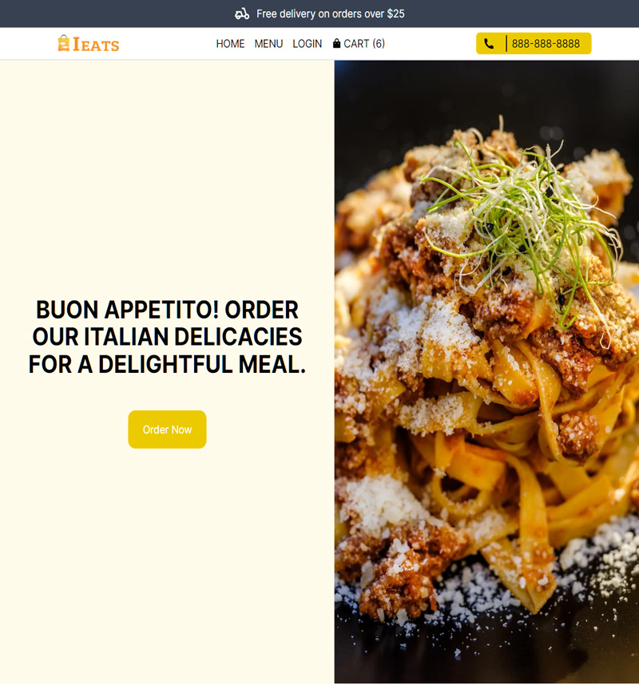

<div id="top"></div>

<!-- PROJECT LOGO -->
<br />
<div align="center">


  <h3 align="center">Online Ordering Application </h3>

  <p align="center">     
    <a href="https://github.com/feliceforgione/iEats2/issues">Report Bug</a>
    ·
    <a href="https://github.com/feliceforgione/iEats2/issues">Request Feature</a>
  </p>
</div>

<!-- ABOUT THE PROJECT -->

## About The Project



Making online ordering easy without the service fees. A full-stack online ordering framework to quickly setup a food serives company.

<br>

## Built With

|                                                   |                                                 |                                            |
| ------------------------------------------------- | :---------------------------------------------: | -----------------------------------------: |
| [Next.js 13](https://nextjs.org/)                 |         [Prisma 5](https://prisma.io/)          |  [PostgreSQL](https://www.postgresql.org/) |
| [TanStack Query 4](https://tanstack.com/query/)   |   [NextAuth.js 4](https://next-auth.js.org/)    |      [Cloudinary](https://cloudinary.com/) |
| [Stripe](https://www.stripe.com/)                 | [TypeScript 5](https://www.typescriptlang.org/) | [Zustand 4](https://zustand-demo.pmnd.rs/) |
| [Google Maps](https://developers.google.com/maps) |     [TailwindCSS](https://tailwindcss.com/)     |          [Docker](https://www.docker.com/) |

<!-- ROADMAP -->
<br />

# Features

- Authenicate uses by using Google, Facebook, or GitHub
- Process payments using Stripe
- Fully reactive and responsive site
- Easily add products and categores as administer
- Manage orders

<!-- ROADMAP -->
<br />

## Getting Started

- Create a `.env` file using `.env-sample` and using your own keys
- Install packages
- Run a docker container using `docker-compose.yml`
- Run the development server:

  ```bash
  npm run dev
  ```

- Open [http://localhost:3000](http://localhost:3000) with your browser to see the result.

<br />

## Roadmap

- [ ] Multi-language Support
- [ ] Discount codes

<br>

See the [open issues](https://github.com/feliceforgione/iEats2/issues) for a full list of proposed features (and known issues).

<br>

<!-- CONTRIBUTING -->

## Contributing

Contributions are what make the open source community such an amazing place to learn, inspire, and create. Any contributions you make are **greatly appreciated**.

If you have a suggestion that would make this better, please fork the repo and create a pull request. You can also simply open an issue with the tag "enhancement".
Don't forget to give the project a star! Thanks again!

1. Fork the Project
2. Create your Feature Branch (`git checkout -b feature/AmazingFeature`)
3. Commit your Changes (`git commit -m 'Add some AmazingFeature'`)
4. Push to the Branch (`git push origin feature/AmazingFeature`)
5. Open a Pull Request

<br>
<!-- CONTACT -->

## Contact

Felice Forgione - [@forgione67](https://twitter.com/forgione67)

Project Link: [https://github.com/feliceforgione/iEats2](https://github.com/feliceforgione/iEats2)
